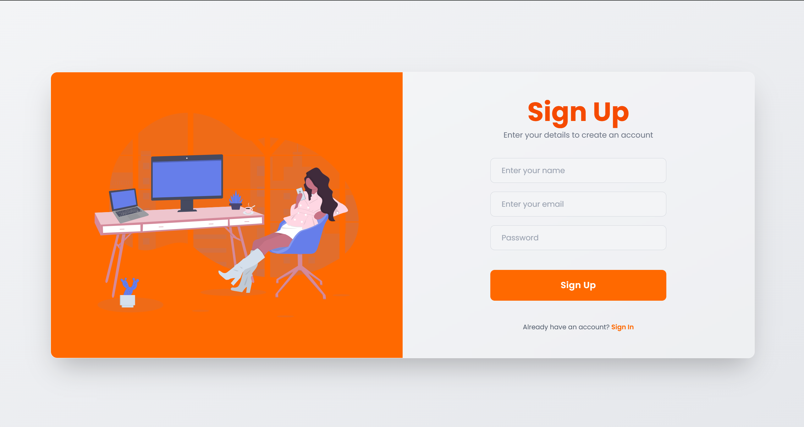
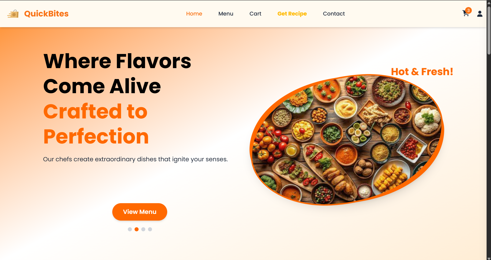
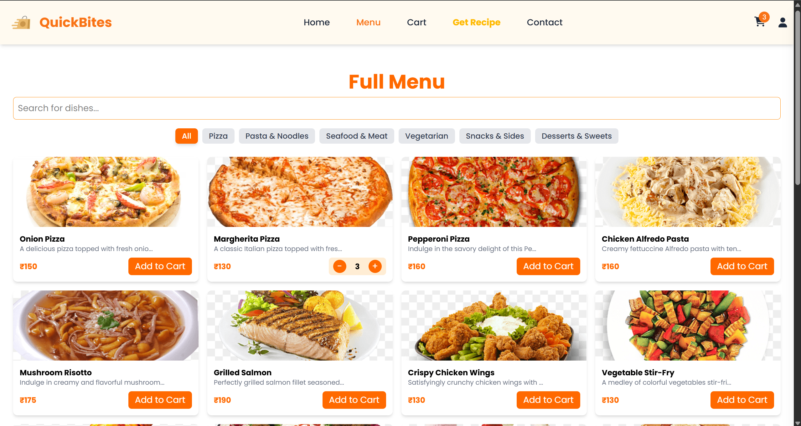
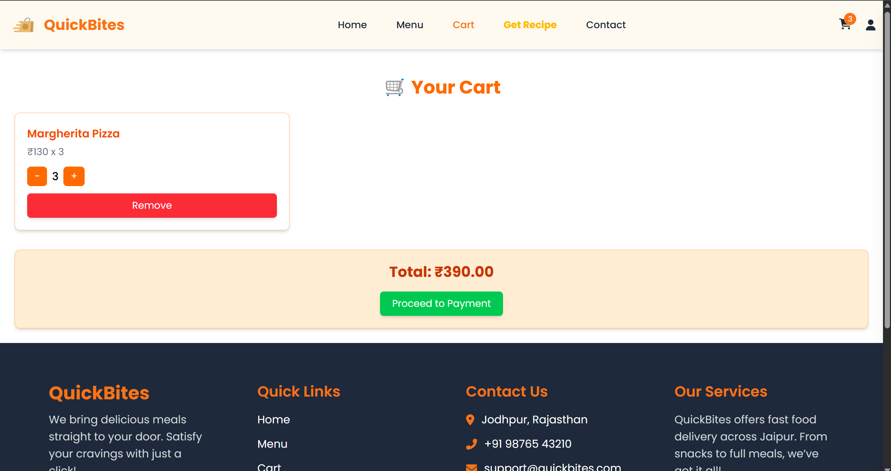
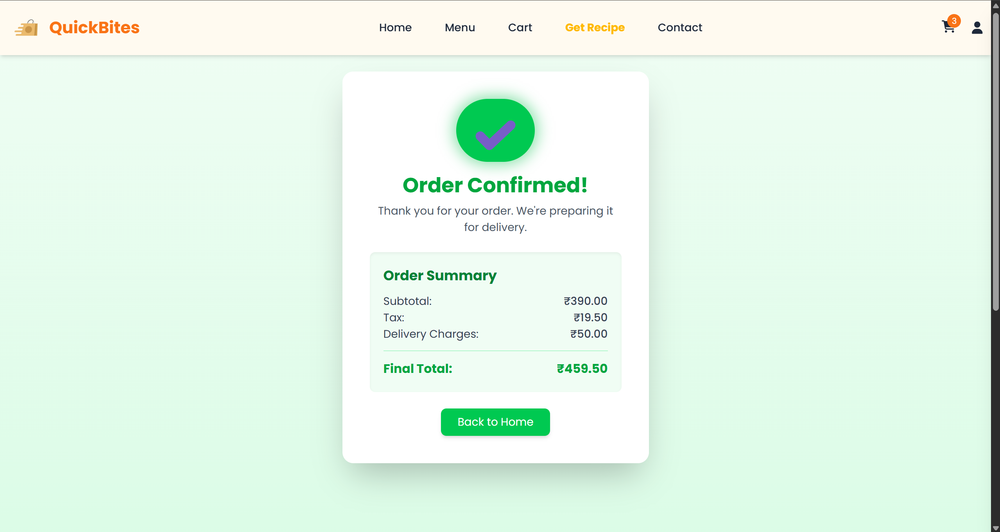
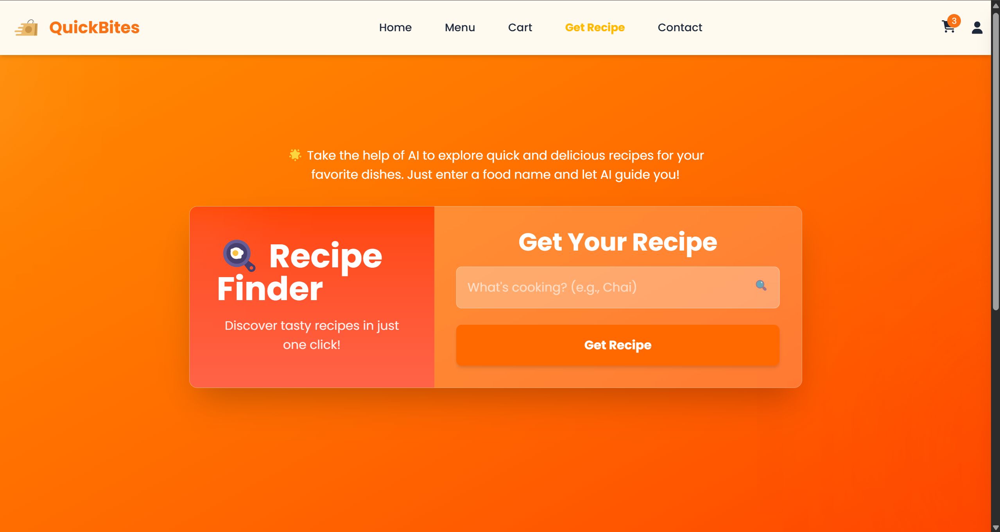

# Quickbites - A Food Delivery Web Application 🍔🍕🍽️

Quickbites is a modern, interactive food delivery web application built with **React**. It features a dynamic, mobile-first design, real-time recipe suggestions, user authentication, and more. This project leverages several powerful technologies to ensure a smooth and engaging user experience.

## Technologies Used

- **React**: A JavaScript library for building user interfaces.
- **Firebase**: For user authentication (Sign In/Sign Up) and real-time data management.
- **Gemini API**: To fetch and display real-time recipe data.
- **Tailwind CSS**: A utility-first CSS framework for responsive and customizable design.
- **Framer Motion**: For smooth, dynamic animations and transitions.
- **React Router**: For seamless navigation between pages.
- **React Hooks**: For managing state and side effects within the app.

## Features

- **Firebase Authentication**: Secure and easy login/registration system.
- **Recipe Suggestions**: Real-time recipe suggestions fetched via the **Gemini API**.
- **Responsive Design**: Built using **Tailwind CSS** to ensure the app works seamlessly across devices (desktop, tablet, and mobile).
- **Dynamic Hero Section**: Auto-sliding carousel showcasing attractive titles and descriptions.
- **Cart Management**: Users can add and manage items in their cart.
- **Smooth Animations**: Using **Framer Motion** for sleek transitions and UI effects.

## Screenshots









## Installation

### Prerequisites

Before running this project, ensure you have **Node.js** installed on your machine. If not, you can download it [here](https://nodejs.org/).

### Steps to Run the Project

1. Clone this repository to your local machine:

    ```bash
    git clone https://github.com/yourusername/quickbites.git
    ```

2. Navigate to the project directory:

    ```bash
    cd quickbites
    ```

3. Install the dependencies:

    ```bash
    npm install
    ```

4. Set up Firebase and add the necessary credentials in a `.env` file:

    ```bash
    REACT_APP_FIREBASE_API_KEY=your_firebase_api_key
    REACT_APP_FIREBASE_AUTH_DOMAIN=your_firebase_auth_domain
    REACT_APP_FIREBASE_PROJECT_ID=your_firebase_project_id
    REACT_APP_FIREBASE_STORAGE_BUCKET=your_firebase_storage_bucket
    REACT_APP_FIREBASE_MESSAGING_SENDER_ID=your_firebase_messaging_sender_id
    REACT_APP_FIREBASE_APP_ID=your_firebase_app_id
    ```

5. Start the development server:

    ```bash
    npm start
    ```

    The app will be available at [http://localhost:3000](http://localhost:3000).

## Contributing

If you'd like to contribute to this project, feel free to fork the repository and submit pull requests. Here are some ways you can contribute:

- Add new features or fix bugs.
- Enhance the UI/UX.
- Improve documentation or code quality.


## Acknowledgments

- **Firebase** for providing the authentication and real-time database.
- **Gemini API** for offering real-time recipe data.
- **Tailwind CSS** for making responsive design easy and fun.
- **Framer Motion** for enhancing animations and transitions.

---

Feel free to reach out if you have any questions or need help with the project!

